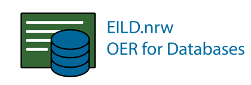

# Entwicklung von Inhalten für die Lehre im Fach Datenbanken in vielfältigen Lernszenarien

## Projektbeschreibung 

Im Projekt [EILD.nrw](eild.nrw) werden Open Educational Resources (OER) für die Lehre im Fach Datenbanken entwickelt. Die Lerneinheiten können in vielfältigen Lernszenarien verwendet werden. Studierende der Informatik und von Anwendungsfächern können den kompletten Lebenszyklus für die Entwicklung von Datenbanken erlernen. Dafür werden Quizze, interaktive Tools, Lehrvideos und Kurse für Lernmanagementsysteme entwickelt und unter einer Creative Commons-Lizenz veröffentlicht.

Die Informatik schafft sich ihre Werkzeuge selbst. So besitzen die Professorinnen und Professoren der Projektpartner jahrelange Erfahrung in der Lehre von Datenbanken mit selbst-entwickelten Lerneinheiten. Etwa 1.000 Studierende der beteiligten Hochschulen können jedes Semester im unterstützten Selbst-Studium Kenntnisse erwerben und praktische Aufgaben zur Konzeptionierung, Erstellung und Programmierung von Datenbanken bearbeiten. Eine Datenbank mit über tausend Fragen, Antworten und Erklärungen wird zur Klausurvorbereitung benutzt.

Das Projekt EILD.nrw wird als eines von 18 Projekten der Förderlinie OERContent.NRW seit dem Wintersemester 2020 durch das Ministerium für Kultur und Wissenschaft des Landes Nordrhein-Westfalen gefördert. Mithilfe der Förderung kann jeder Projektpartner eine wissenschaftliche Mitarbeiterin oder einen wissenschaftlichen Mitarbeiter und Studierende als Hilfskräfte über knapp zwei Jahre finanzieren. Die in diesem und den weiteren Projekten der Förderlinie entstehenden Inhalte werden unter der Lizenz CC BY-SA 4.0 – Teilen und Bearbeiten unter Namensnennung und Weitergabe unter gleichen Bedingungen – auf der Plattform [ORCA.nrw](https://www.orca.nrw/) zur Verfügung gestellt. EILD.nrw ist ein Kooperationsvorhaben der Digitalen Hochschule [DH.NRW](https://www.dh.nrw/).

## Weiterführende Links:

* [Übersichsseite EILD.nrw](https://medien.hs-duesseldorf.de/forschung/forschungsprojekte/eild/Seiten/default.aspx)
* [Projektergebnisse](https://medien.hs-duesseldorf.de/forschung/forschungsprojekte/eild/Seiten/Ergebnisse.aspx)
* [Publikationen](https://medien.hs-duesseldorf.de/forschung/forschungsprojekte/eild/publikationen)
